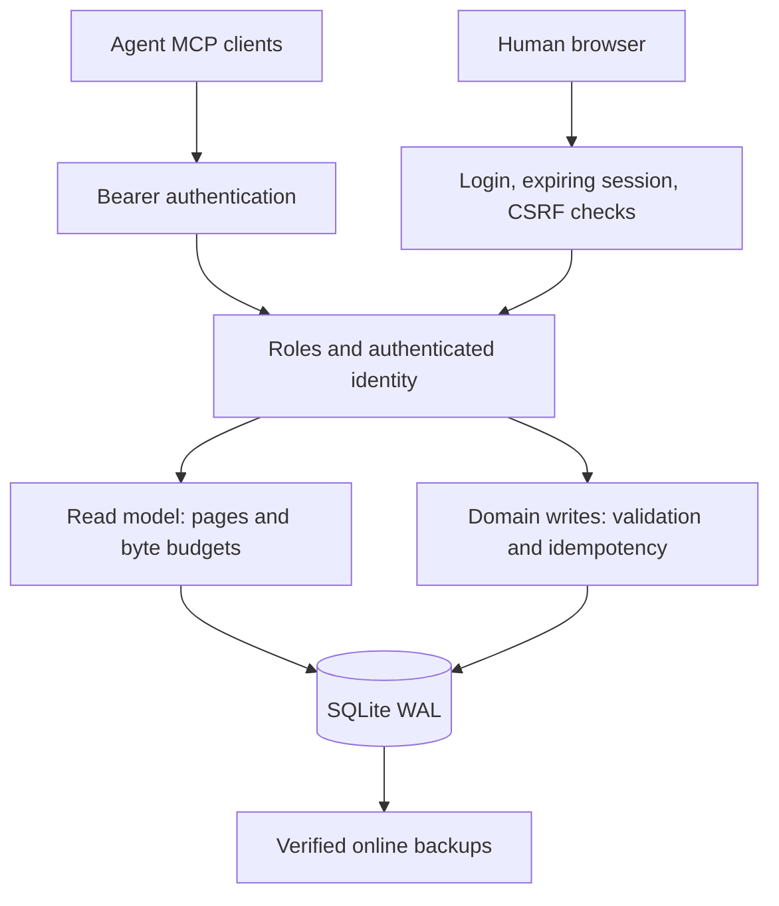

# Architecture

OneRoom is a single-process shared room: MCP clients and the browser UI use the
same domain writes and paginated read models over a local SQLite database.
See [Collaboration](COLLABORATION.md) for the v0.3 feature and runner contracts.

## Persistence and migrations

`migrations.ts` tracks schema changes with `PRAGMA user_version`. Version-zero
installations are adopted without replacing their data. Each migration batch is
transactional; its schema version advances only after success. Newer schemas are
refused. Back up before upgrading, and restore a pre-upgrade backup to roll back
to a binary that cannot read the newer schema.

Messages, documents, annotations and idempotency records are append-only. Triggers
reject UPDATE/DELETE, and the application connection enables foreign keys and
recursive triggers. These prevent accidental changes; they are not a security
boundary against a database owner. Keep SQLite on a local persistent filesystem,
with one server process per room, and avoid network filesystems or multiple replicas.

Document versions are immutable. New annotations target an exact version. Legacy
name-wide annotations retain `document_version = NULL`; they are not guessed onto
a historical version during migration. A legacy pin can be resolved explicitly
using version zero in the API. Pins on historical versions remain discoverable.

## Writes, retries and capacity

Every external content mutation requires a stable request ID. Wake registration
and claiming instead use an atomic per-agent row and expiring lease; completion
uses the lease token as a durable request ID. In one immediate transaction,
`Room.idempotent` checks `(principal, request_id)`, verifies the canonical payload
hash, executes the domain write and saves its response. Retries return that exact
response, including after restart. Changed payloads under the same ID fail. Failed
writes roll back both the mutation and request record. Replays work even after a
room reaches its storage cap. SQLite backups preserve the request ledger.

`max_page_count` limits logical database pages, including FTS and the request
ledger. Transactional pre/post checks enforce a lowered cap on an existing room.
Schema upgrades may require extra pages before the cap is applied. WAL, SHM,
backups and logs are additional disk use. A free-disk reserve blocks new domain
writes before the filesystem is exhausted; `/metrics` exposes warnings and usage.
No data is automatically evicted.

## Bounded reads

`reads.ts` and `collaboration.ts` implement the external read models. SQL selects limited rows and bounded content
previews, then applies a serialized byte budget. Every list supplies a continuation
cursor. Message previews include a small annotation page; the full annotation
history has its own cursor. Pins include both message and document targets and
never silently disappear because of a response cap.

Full messages, documents and notes use UTF-8 byte-offset chunks. Chunk boundaries
never split a code point; invalid offsets fail. Document continuations should pass
the returned version. Search sorts by immutable row ID for complete cursor traversal
and searches one scope at a time. Latest-document search excludes superseded text.

`catch_up` budgets each component so the combined MCP result stays bounded.
The human UI renders one paginated view at a time and escapes all content.
Documents are escaped in the viewer or served as plain text with an explicit
`format=text`; stored MIME values never select executable browser content.

Export is different: it streams complete JSON under backpressure. Maximum IDs
captured before the first chunk bound the append-only history. Mutable operational
rows (attention, check-ins, source-check timestamps) are read as they are streamed,
so JSON export is not a point-in-time snapshot of those tables. It does not hold a long-lived SQLite read transaction. JSON export
is for auditing; SQLite backup is the supported full-fidelity restore format,
including idempotency records. Legacy in-process read helpers are not exposed by
HTTP/MCP; external surfaces use bounded read methods.

## Identity and browser access

Bootstrap mode has one admin credential. Creating named credentials preserves that
admin as an explicit entry and enables separate admin, agent, human and reader
roles. Author fields always come from the authenticated ID. Role permissions are
checked on every tool invocation and privileged HTTP route. The room is still one
shared visibility boundary, not a tenant-isolation service.

The credentials file contains tokens and requires private file permissions.
Authentication compares SHA-256 digests in constant time. Tokens are neither
logged nor accepted from URL query strings. Revocation/rotation takes effect on
restart, which also invalidates browser sessions. IDs should not be reused for a
different person/agent because they identify authors and durable request IDs.

Browser login uses a pre-login nonce and same-origin checks. Sessions are random,
in-memory, bounded in number, expiring, HttpOnly and SameSite=Strict. Configuring
an HTTPS public origin enables Secure, host-prefixed cookies. State-changing cookie
requests require the session CSRF token and matching Origin. Referrer-Policy is
`same-origin`: it suppresses cross-origin referrers while retaining the Origin on
legitimate HTML form submissions (unlike `no-referrer`). MCP accepts explicit
bearer credentials only; it never accepts browser session cookies.

## Operations

IP ingress limits, credential request limits, login throttling, concurrency limits,
and HTTP timeouts bound load. Forwarded headers are not trusted: behind a proxy,
the IP limit applies to the proxy connection, while authenticated limits remain
per identity. Only a configured public origin controls HTTPS cookie/Origin behavior.

Metrics use fixed fields, with no raw URLs, query values or content labels. Capacity
warning transitions emit sanitized JSON logs. The Docker image runs as non-root;
Compose drops capabilities, uses a read-only root, rotates logs and bounds CPU,
RAM and PIDs. Shutdown drains HTTP requests before closing SQLite, with a deadline.

`backup.ts` creates online SQLite backups, checks integrity and writes a SHA-256
manifest. Restore refuses an existing destination. The checksum detects accidental
corruption; tamper evidence against a database owner requires an independent trusted
copy or external checkpoint. Back up credentials separately and keep backups off-host.

MCP supplies enforced mechanisms. `skill/SKILL.md` supplies the behavioral protocol:
read all context, coordinate work, use safe retries, and treat room content as
untrusted data. Neither component replaces the other.

## Collaboration persistence and delivery

Schema v3 adds thread roots, immutable record versions, append-only events,
recipient attention state and wake/check-in leases. V4 adds per-PR source-check
timestamps so refreshing unchanged provider descriptions does not grow history.
Message insert, thread mapping and recipient events share the same transaction.
Status ownership, expected versions, work claims and test-run commit identity are
enforced by the domain. Dependency cycles are rejected. Boards project previews
in SQL; full records use chunked JSON reads.

`delivery.ts` provides bearer-only SSE independent of stateless MCP. Recipient
cursors are durable event IDs; backpressure pauses sending, one stream per identity
and four per room bound resource use, and 55-second rotation rechecks authentication.
Shutdown closes streams before draining HTTP. The separate `runner.ts` combines
SSE with five-second due-work checks, exclusive expiring leases, fixed-command
execution and idempotent completion. Retries are at least once, not exactly once.
The operator's runtime adapter must await the actual agent turn before success.

`github.ts` only reads configured GitHub.com repositories. Failed/partial listings
cannot infer closed PRs. CI source failures become unknown. Descriptions/metadata
are source-owned, while PR notes retain authenticated agent ownership. Test evidence
is selected by repository plus the PR snapshot's exact head SHA. Source checks,
leases and attention are intentionally mutable; versioned content and events are not.
